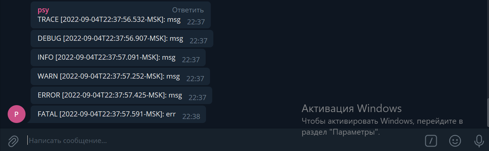

# Salt - telegram logger


## Installation
1) Install the package
```bash
    go get -u github.com/bulatok/salt
```
2) Import to your code
```go
    import "github.com/bulatok/salt"
```
## About
    Very simple and tiny logger. All logs are sent with telegram bot via telegram-api.

## Usage
```go
package main

import (
	"fmt"
	"log"

	"github.com/bulatok/salt"
)

func main() {
	token := "your bot token (create in https://t.me/BotFather)"
	logger, err := salt.NewDev(token, &salt.Options{},
		salt.Chat("-100XXXXXXX (chat must start with -100)"),
		salt.Private("XXXXXXX"),
		salt.Channel("XXXXXXX"),
		// .....
	)
	if err != nil {
		log.Fatal(err)
	}

	if err := logger.Info("some info"); err != nil {
		// errors of salt - salt.ErrInvalidToken, salt.ErrChatNotFound
		// or
		// some error during POST request to api
	}
	
	logger.Trace("msg")
	logger.Debug("msg")
	logger.Info("msg")
	logger.Warn("msg")
	logger.Error("msg")
	logger.Fatal("err")
	logger.Panic("panic") // just for example
}
```
samle output
